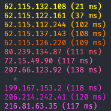

<div align="center">
    
</div>

# Hyperoute

Hyperoute is a simple, fast, and flexible traceroute. It's written in C and uses raw sockets to send and receive ICMP packets.
It's designed to be as simple as possible, and to be easily extended.

<div align="center">
    
</div>

## Usage

Hyperoute is designed to be as simple as possible. It takes a single argument, which is the host to trace to. It will then print out the route to that host. It will also print out the IP address of each hop, and the time it took to reach that hop.

You may have to run hyperoute as `root` as it uses raw sockets.

```bash
# Sample usage
sudo hyperoute 8.8.8.8
```

## Installation

Installation is simple. Just run `make` and then `sudo make install`. This will install hyperoute in a place where it can be found by your shell.

This program works well on Mac OS (11.0.0 and higher) and Linux.

## Uninstallation

To uninstall hyperoute, run `sudo make uninstall`. This will remove the binary from your system.

